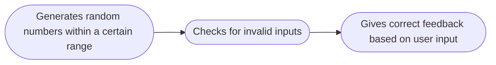

##Implementing a Random Guessing Game

```mermaid
flowchart LR
    A([Generates random numbers within a certain range]) --> B([Checks for invalid inputs]) --> C([Gives correct feedback based on user input])
```